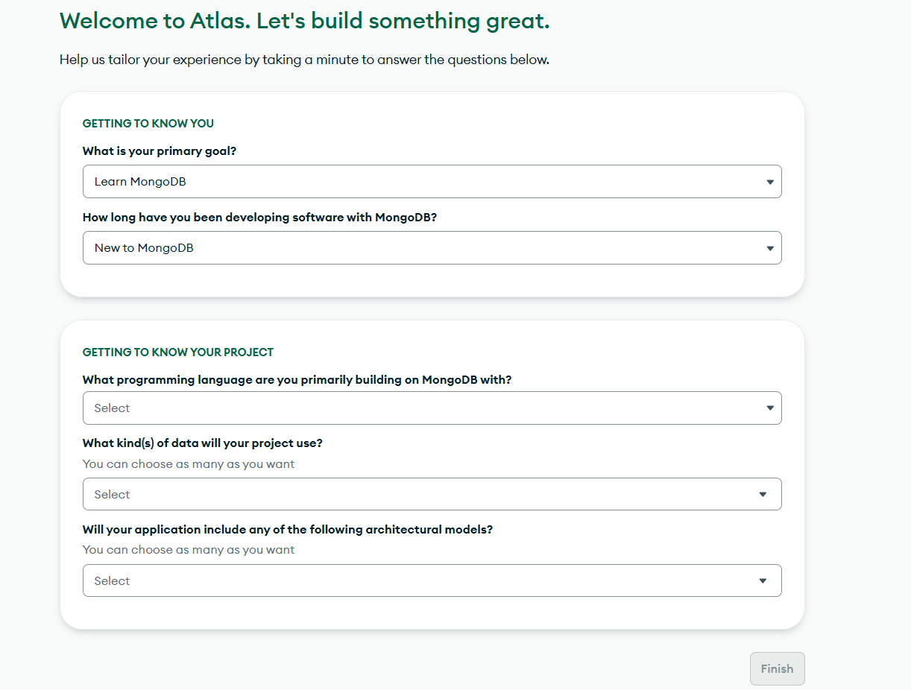
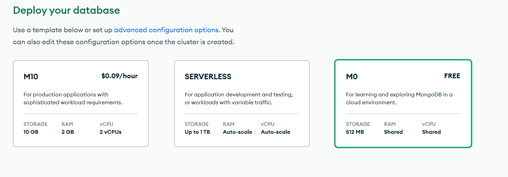
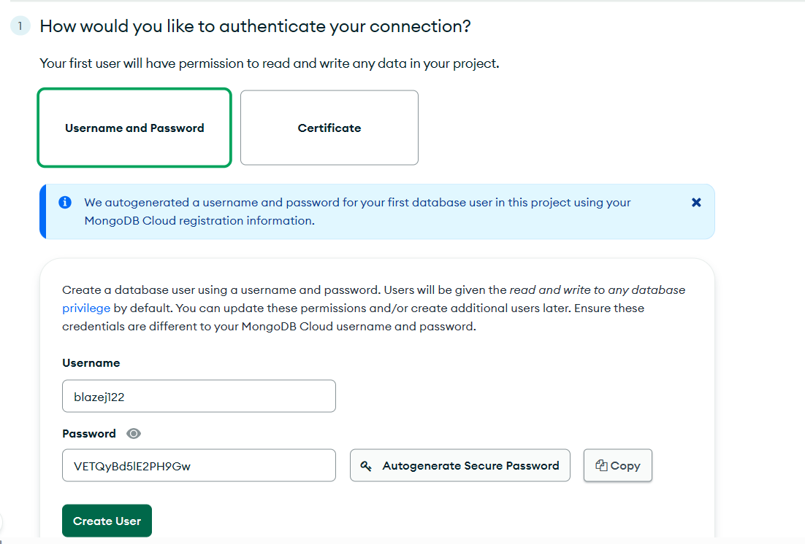
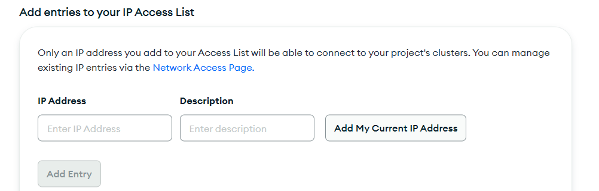
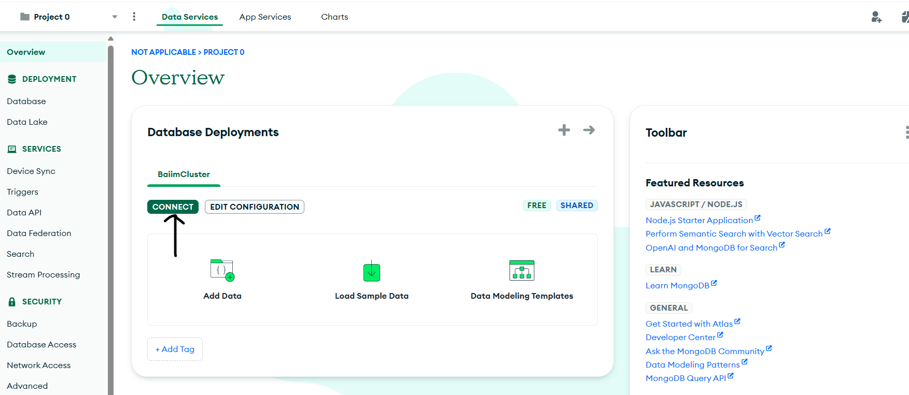
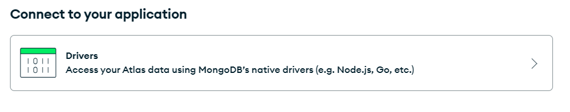
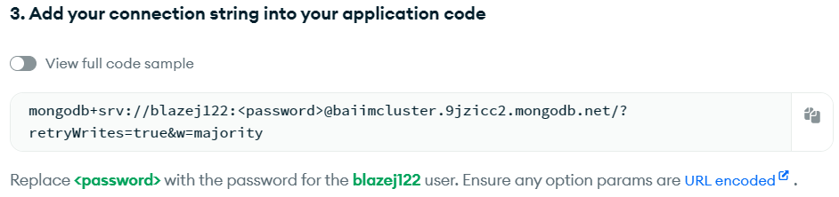

# Wprowadzenie

Jest to repozytorium zawierające przykładowy projekt z wykorzystaniem node.js oraz mongoDB. Jego celem jest praktyka zabezpieczania aplikacji internetowych.

Plan projektu:

- Instalacja projektu
- Wprowadzenie do struktury projektu
- zad. 0 (konfiguracyjne)

## Instalacja projektu

1. Pobierz projekt za pomocą komendy:

```bash
git clone https://github.com/bpajor/baiim.git
```

2. Przejdź do folderu baiim

```bash
cd baiim
```

3. Zainstaluj niezbędne biblioteki:

```bash
npm install
```

## Wprowadzenie do struktury projektu

- ### App.js

Jest to główny plik, w którym uruchamiany jest serwer. Do niego importujemy pozostałe niezbędne pliki.

- ### controllers/controllers.js

Jest to plik w którym znajdują się tzw. 'controllers' które służą do obsługiwania endpointów. Tutaj można np. odczytać dane z requestu czy też wysłać zapytanie do bazy danych.

- ### routes/routes.js

Jest to plik służący do "wyłapywania" danych requestów, w tym pliku będziemy dokonywać walidacji pól.

- ### views

Jest to folder w którym znajdują się templatki ejs (ejs to html z możliwością wstawiania dynamicznej zawartości).

- ### package.json

Jest to plik konfiguracyjny, w którym znajdują się odnośniki do zainstalowanych paczek, różne skrypty itd.

## Zad. 0 (konfiguracyjne)

Celem tego zadania jest założenie konta w MongoDB (nierelacyjnej bazie danych). Oto wymagane kroki:

### 1. Przejdź na stronę: [Stwórz konto w MongoDB](https://account.mongodb.com/account/register)

### 2. Stwórz konto za pomocą konta google, github lub domyślnie kontem e-mail:


### 3. Wypełnij początkowy dialog:



### 4. Powinien wyświetlić się dialog z wyborem parametrów bazy. Wybieramy opcję darmową:



### 5. Trafiamy na dialog z ustawieniami konta:



Ustawiamy swój login oraz hasło. Klikamy 'Create user'.

<b>Pamiętaj o zapisaniu hasła !!!</b>

W drugim kroku na tej stronie kliknij "Add My Current IP Address"

Jeśli zauważysz komunikat 'This IP address has already been added.' przejdź dalej.



Na dole strony kliknij "Finish and close".

Stworzyliśmy bazę danych z której będziemy mogli korzystać w następnych krokach.

### 6. Uzyskanie URI do połączenia się z API MongoDB

W zakładce overview znajdź swój 'Cluster' czyli inaczej swoją bazę. Kliknij connect.



Kliknij w zakładkę drivers:



Tutaj znajdziesz URI do swojego projektu - skopiuj je:



Następnie w pliku app.js umieść tą linijkę kodu po początkowych importach:

```javascript
const URI = `TWOJE_URI`;
```
Podmień password na hasło otrzymane od MongoDB.

### 7. Uruchomienie projektu

Uruchom projekt za pomocą komendy:

```bash
npm start
```

## Zadanie 1 - Zmienne środowiskowe

Celem tego zadania będzie poprawne skonfigurowanie zmiennych środowiskowych, aby zmienne wrażliwe nie były widoczne w projekcie (nie licząc pliku package.json).

Ustaw zmienne środowiskowe a następnie zamień dane wrażliwe na zmienne środowiskowe według składni przedstawione w prezentacji.

Jako potwierdzenie wykonania zadania wyślij plik app.js oraz package.json

## Zadanie 2 - Walidacja pól

Celem tego zadania jest zapobieganie atakom typu XSS poprzez walidację pól wejściowych.

Zaimplementuj walidację pól wejściowych w pliku routes.js. Użyj jednej ważnej funkcji przedstawionej na prezentacji. Dodatkowo możesz zdefiniować zasady dostarczane przez paczkę express-validator

Link do dokumentacji paczki: [express-validator - docs](https://github.com/validatorjs/validator.js)

W wyniku wykonania zadania nie może być możliwe wpisanie tagów html do inputów. Jako rozwiązanie zadania wyślij plik routes.js.

## Zadanie 3 - Zapobieganie wyświetlania ciaszteczek w konsoli deweloperskiej

Jest to zadanie które również ma na celu zapobieganie ataków typu XSS poprzez dostęp do ciasteczek w konsoli deweloperskiej. Zmodyfikuj plik app.js aby wyświetlanie ciasteczek było niemożliwe.

Sprawdź czy ciasteczka się nie wyświetlają.

Jako wynik zadania wyślij plik app.js.

## Zadanie 4 - Hashowanie haseł (bcrypt)

Celem tego zadania jest hashowanie haseł za pomocą biblioteki bcrypt. Aby skorzystać z biblioteki zaimportuj ją w pliku controllers:

```javascript
import bcrypt from "bcryptjs";
```

Następnie w tym pliku zmodyfikuj funkcje postSignup oraz postLogin aby nie operowały na nie hashowanych hasłach czyli:

- hashowanie hasła przed wysłaniem do bazy
- porównanie zwykłego hasła do hashowanego

Obie rzeczy można wykonać za pomocą funkcji zdefiniowanych w bcrypt. Są one przedstawione na prezentacji.

Dokumentacja: [bcrypt - docs](https://www.npmjs.com/package/bcrypt)

Jako wynik zadania wyślij plik controllers.js
